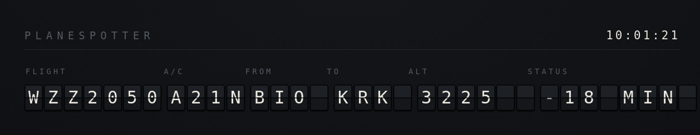

# Planespotter

A little application that displays nearby flights.
Do you live near an airport and ever wonder whether the plane nearby is full of people late for something? See for yourself.

Features

- Uses [adsbdb](https://www.adsbdb.com/)'s free API to check for nearby planes.
- Optionally enriches the ADS-B data with [Aerodatabox](https://aerodatabox.com/), if an API key is provided.

## Configuration

Copy the `planespotter.toml.example` and add your own region.
You can use a tool like https://geojson.io/ to draw an arbitrary polygon around some area (from which you can hear planes, for example).

To get flight status information, you must create an Aerodatabox API key.
The free tier is sufficient for personal use.

## Disclaimer

This is a little vibe-coded project through and through.
It will likely get minimal maintenance, sorry.